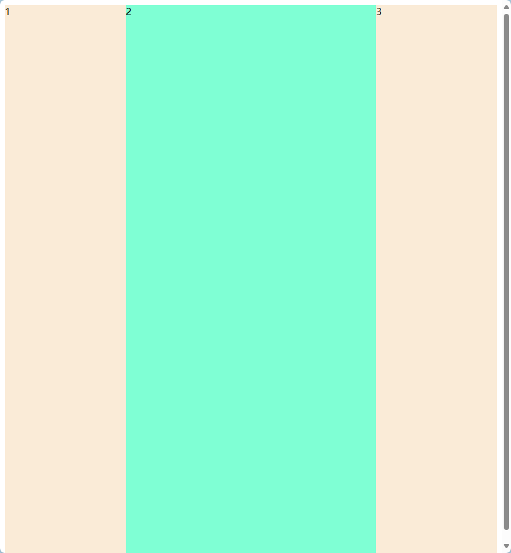
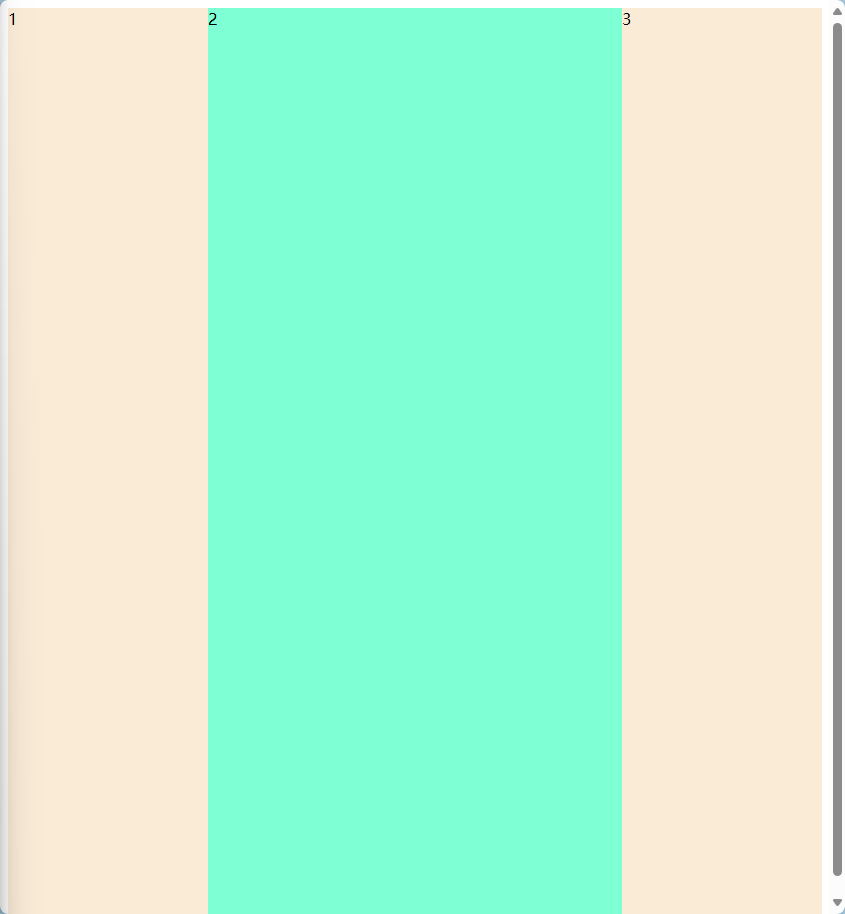

# CSS

这是关于CSS的面试题。

## 1. 什么是BFC？如何触发？有何特点？如何解决margin塌陷？

BFC指的是块级格式化上下文，它是一个独立的渲染区域，只有自己和浮动的元素不会被包含在内。

理解：BFC元素可以理解成被隔离的区间（BFC的子元素不会对外面的元素产生影响）

如何触发：
1. 设置float不为none
2. 设置overflow:hidden | scroll | auto; （不是visible）
3. 设置position:absolute | fiexed ;（ 非relative）
4. 设置display:inline-block | table-cell | table-caption | flex | grid ;（ 非none 非inline 非block）

能解决什么问题？
1. 兄弟标签间margin重叠问题（给一个标签弄成BFC）
2. 父子之间margin会一起移动问题（给父元素加BFC,overflow:hidden;）
3. 子元素浮动时，父元素高度塌陷问题（给父元素上BFC，例如overflow:hidden;）
4. 浮动时存在浮动元素覆盖普通元素，给浮动元素添加BFC（浮动元素display:flow-root;）

有何特点：
1. 浮动元素会被包含在BFC中
2. 内部元素不受外部影响
3. 自身不会受浮动元素覆盖

## 2. CSS如何处理溢出，说一下overflow不同值的区别

CSS溢出的话可以通常使用overflow进行处理，overflow有4种值：visible | hidden | scroll | auto。

visible：默认值，元素内容超出容器时，溢出部分会显示在容器外。

hideen：超出部分会被隐藏。

scroll：“滚动条”显示在容器内，超出部分滚动。

auto：根据情况，如果内容溢出，则显示滚动条，否则不显示。

## 3. 三栏布局有什么实现方法

### 1. 使用flex布局：

```
<style>
    .box {
        display: flex;
        height: 100vh;
    }
    .left,.right {
        background-color: antiquewhite;
        width: 200px;
    }
    .center {
        flex: 1;
        background-color: aquamarine;
    }
</style>

<div class="box">
    <div class="left">1</div>
    <div class="center">2</div>
    <div class="right">3</div>
</div>
```

### 2. 使用float布局：
```
<style>
    .left,.right {
        background-color: antiquewhite;
        width: 200px;
        height: 100vh;
    }
    .left {
        float: left;
    }
    .right {
         float: right;
    }
    .center {
        margin: 0 200px;
        height: 100vh;
        background-color: aquamarine;
    }
</style>

<div class="left">1</div>
<div class="right">3</div>
<div class="center">2</div>
```


### 3. 使用position布局：
```
<style>
    .left,.right {
        position: absolute;
        background-color: antiquewhite;
        width: 200px;
        height: 100vh;
    }
    .left {
        left: 0;
    }
    .right {
        right:0;
    }
    .center {
        position: absolute;
        background-color: aquamarine;
        left: 200px;
        right: 200px;
        height: 100vh;
    }
</style>

<div class="left">1</div>
<div class="right">3</div>
<div class="center">2</div>
```
效果一样,此处省略.....
除此之外还有grid、table布局，此处省略，自行练习。

## 4.说说calc并解释其作用？

calc()函数是css3新增的一个函数，用来计算表达式的值。

calc(x - x),注意x可以是负数，也可以是百分比，也可以是em，px等，也可以是任意css属性值，如width，height等。表达式需要用空格隔开。

## 5.CSS3新增的特性有哪些？

## 5.CSS3新增的特性有哪些？

1. 渐变：分为linear-gradient：线性渐变和radial-gradient：径向渐变
2. 变形：transform：变形，包括旋转(rotate)、缩放(scale)、移动(translate)、倾斜(skew)等。
3. 过渡：transition主要是对样式的过渡效果，过渡效果可以设置时间，过渡效果可以设置属性，过渡效果可以设置动画效果。
4. 动画：animation
5. 盒子阴影：box-shadow：10px(水平阴影位置x) 10px(垂直阴影位置y) 5px(模糊距离) 5px(阴影大小) #888888(阴影颜色);
6. 媒体查询：@media (all(用于所有多媒体类型设备)、print(用于打印机)、screen(用于电脑屏幕，平板，智能手机等)、speech(用于屏幕阅读器))
7. 伪类:hover、active、focus、link链接没有被访问过、visited链接被访问过
8. 伪元素::before、::after
9. 盒模型：标准盒模型(width(content) + padding + border + margin)和怪异盒模型(width(content + padding + border) + margin)
10. 弹性布局：flex(flex-grow、flex-shrink、flex-basis、flex-direction、flex-wrap、justify-content、align-items、align-content)
11. 网格布局：
    fr单位代表网格容器中可用空间的一等份

    grid(grid-template-columns用于指定列的宽度

    grid-template-rows用于指定行的高度

    grid-template-areas:'area'可以指定网格布局的每个区域的名称，多行使用多个''

    grid-template-columns:可以设置每一列的宽度

    grid-column-start：指定网格元素列的开始位置

    grid-column-end：指定网格元素列的结束位置

    grid-column定义网格元素列的开始和结束的位置

    grid-row-start：指定网络元素行的开始位置

    grid-row-end：指定网格元素行的结束位置

    grid-row定义网格元素行的开始和结束位置

    grid-area是grid-row-start,grid-column-start,grid-row-end以及grid-column-end属性的简写。(grid-area:1/2/5/6表示从第1行开始和第2列开始，第5行和第6列结束)，除此之外还可以对改元素进行命名预grid-template-areas结合使用
    
    grid-column-gap：用来设置行之间的网格间隔
    
    grid-row-gap:用来设置列之间的网格间隔
    
    grid-gap:是grid-row-gap和grid-column-gap的简写
    
    justify-items:这只是对网格元素进行水平对齐
    
    align-items：对每个元素进行垂直对齐
    
    justify-content分配网格行轴的元素之间及其周围的空间
    
    align-content分配网格列轴的元素之间及其周围的空间)
12. 边框：border-radius：圆角、border-image：图片边框


