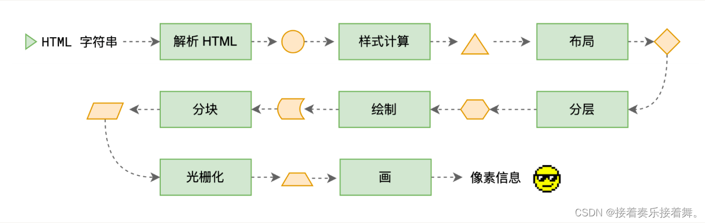

# 网络与浏览器

## 1. 在浏览器访问一个网址后会背后渲染的过程？
1. 浏览器查找域名对应的IP地址(DNS查询：浏览器缓存->系统缓存->路由器缓存->ISP DNS缓存->根域名服务器)
2. 浏览器像web服务器发送一个HTTP请求(TCP三次握手)
3. 服务器301重定向到新的地址
4. 浏览器再次向新的地址发送HTTP请求
5. 服务器返回HTML页面
6. 浏览器进行DOM树构建
7. 浏览器发送请求获取嵌入HTML中的资源(如图片、音频、视频、CSS、JS等)
8. 浏览器显示完成页面
9. 浏览器发送异步请求

### 详细过程
>浏览器渲染过程
>首先，浏览器的网络线程会发送 http 请求，和服务器之间进行通信，之后将拿到的 html 封装成一个渲染任务，并将其传递给渲染主线程的消息队列。在事件循环机制的作用下，渲染主线程取出消息队列中的渲染任务，开启渲染流程。

>网络线程和服务器之间通信的过程主要是三次握手建立tcp链接，服务器收到请求后返回响应报文，但是本文主要讲述浏览器的渲染进程如何将一个密密麻麻的 html 字符串渲染成最终页面的。

>我们先来看一下整体流程，整个渲染流程分为多个阶段，分别是： HTML 解析、样式计算、布局、分层、生成绘制指令、分块、光栅化、绘制：

>HTML 解析：HTML 解析器将 HTML 字符串解析成 DOM 树(一个对象)，并生成一个渲染任务。至于为什么需要解析成对象是因为后续操作使用字符串不好管理和操作。

>样式计算：样式计算器根据 DOM 树和 CSSOM 树，计算出每个节点的样式属性，并生成一个渲染任务。

